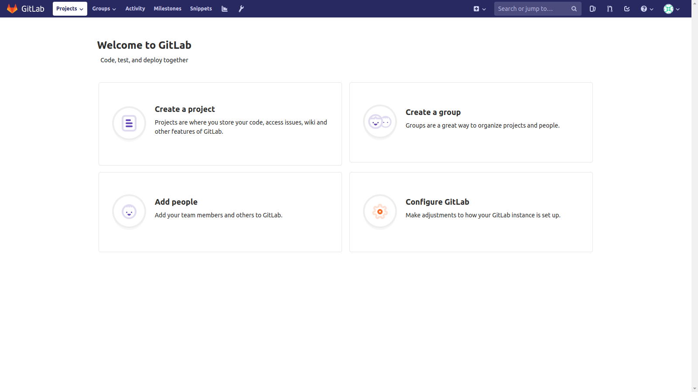
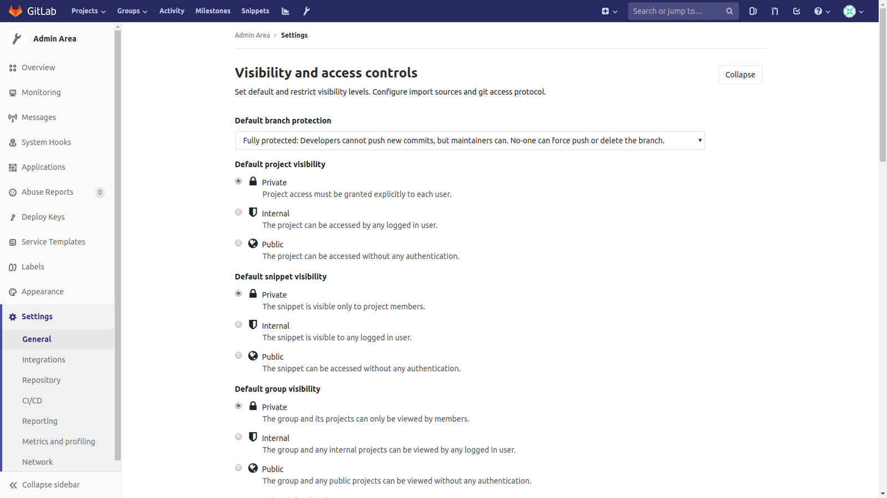
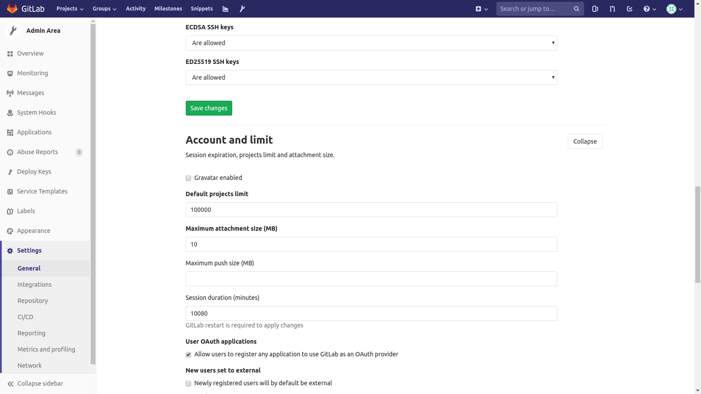

# GitLab初回ログイン
## ログイン

## パスワード変更

## ようこそ画面

# LDAP
## ログイン確認

# Admin Area
## Users/New User追加

## Integrations/PlantUML設定
#### 設定前

#### 設定後

## Settings/Visibility and access controls設定
#### 設定前

#### 設定後

### Settings/Network設定
#### 設定前

#### 設定後

# 新規プロジェクト作成

## 新規グループ作成

## bower-hello-world作成

## samplepj作成
### Blank project作成

### Settings/Members設定

### Integrations/Webhooks設定

# Mattermost初回ログイン

## ログイン

## Auth認証設定

## Team設定

## Welcome画面

## チャット画面

