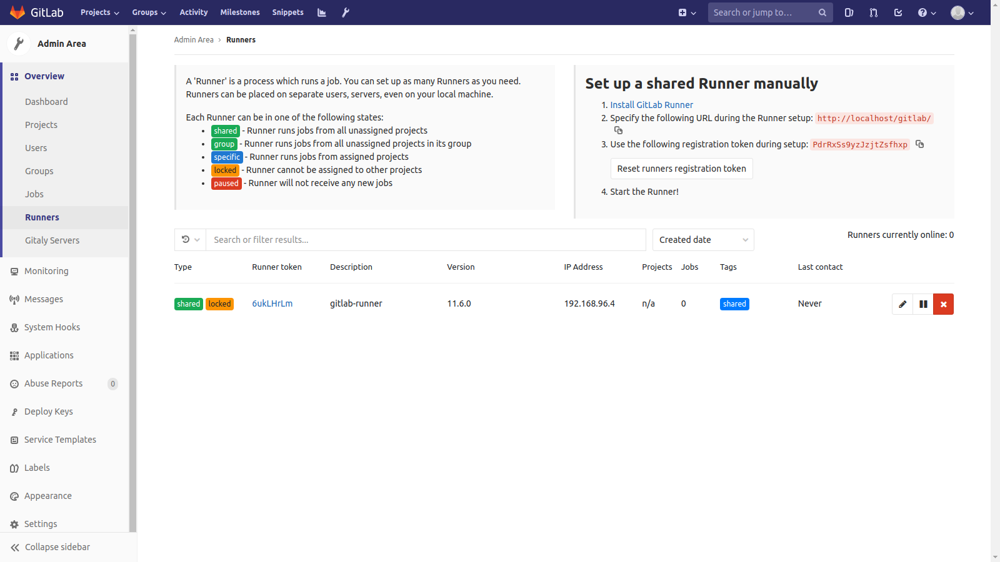

# 登録

## プロジェクト共通ランナー登録

```shell
$ docker-compose exec gitlab-runner gitlab-runner "register" \
  --non-interactive \
  --url "http://gitlab/gitlab" \
  --registration-token "EQaYpcTFTfzzmD9CSpax" \
  --description "gitlab-runner" \
  --tag-list "shared" \
  --executor "docker" \
  --docker-image alpine:latest \
  --run-untagged \
  --locked="false"  
```

## プロジェクト固有ランナー登録

```shell
$ docker-compose exec gitlab-specific-runner gitlab-runner "register" \
  --non-interactive \
  --url "http://gitlab/gitlab" \
  --registration-token "EQaYpcTFTfzzmD9CSpax" \
  --description "gitlab-specific-runner" \
  --tag-list "specific" \
  --executor "docker" \
  --docker-image alpine:latest \
  --run-untagged \
  --locked="true"
```

[by Registering Runners](https://docs.gitlab.com/runner/register/#docker)

## Admin Area/Runners設定確認

- 登録したRunnerに該当する行が追加されていることを確認する。
- Runners currentrly onlineと行数が一致することを確認する。

