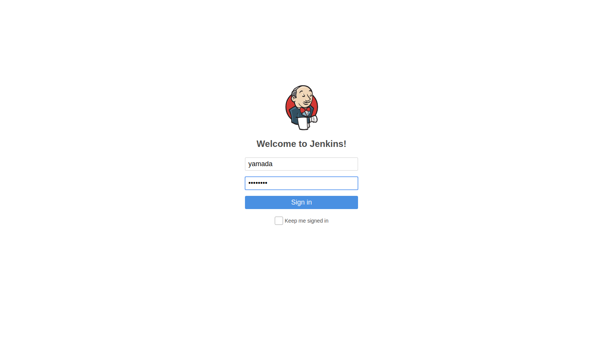
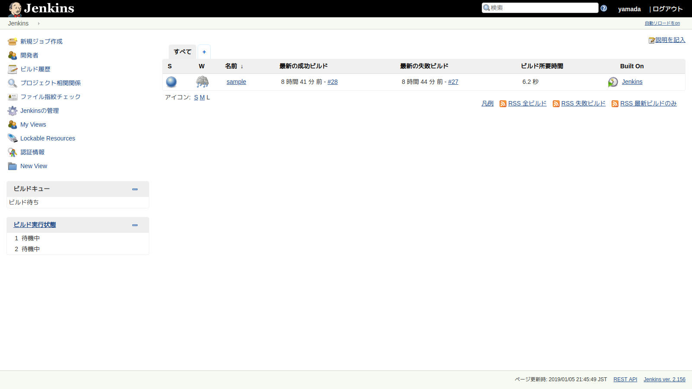

1. 基本設定

   1. アンロック

      

   2. カスタマイズ

   3. Global Tool Configuration

      1. 設定変更前

         

         

      2. 設定変更後

         

         

2. GitLab用設定

   1. ユーザ作成

      

   2. ユーザ設定変更

      1. 変更前

         

         

      2. 変更後

         

   3. 認証情報追加

      

      

3. LDAP用設定

   1. グローバルセキュリティの設定

      1. 変更前

         

         

         

      2. 変更後

         

         

         

   2. ログイン確認

      

      

4. サンプルジョブ作成

   1. 新規ジョブ作成

      

      

      

      

      