# ログイン

トップページでloginを押す。

Login DNとPasswordを入力する。

| 設定項目 | 設定値                     | 備考 |
| -------- | -------------------------- | ---- |
| Login DN | cn=admin,dc=example,dc=com |      |
| Password | ldappw                     |      |

ログインできた。

# 設定

## グループ作成

dc=example, dc=comをクリック。

Create a child entryをクリック。

Generic: Organisational Unitをクリック。

| 設定項目            | 設定値 | 備考 |
| ------------------- | ------ | ---- |
| Organixational Unit | groups |      |

Commitをクリック。

作成された。

## ユーザ追加

### ユーザ作成

ou=peopleをクリック。

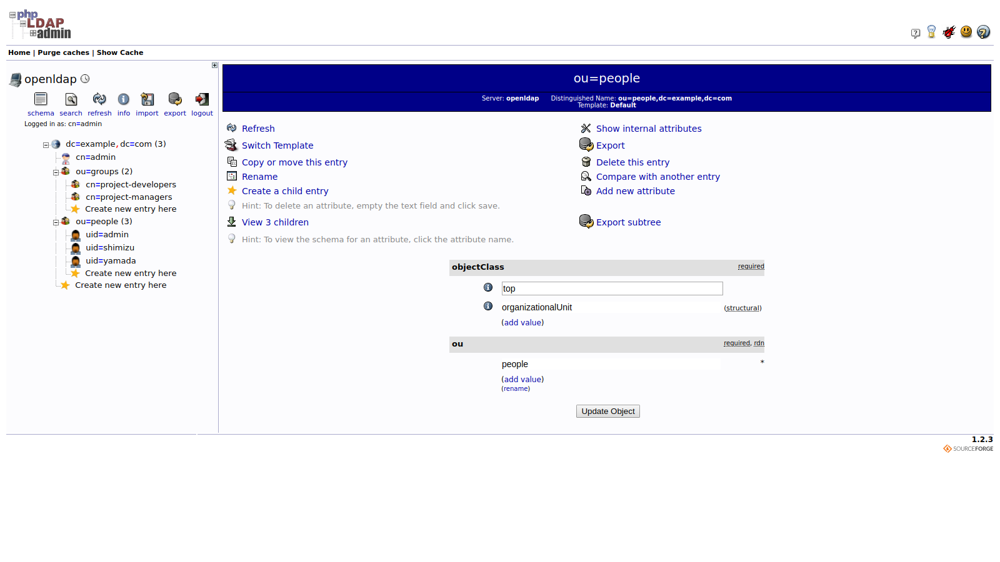

Create a child Entryをクリック。

Defaultをクリック。

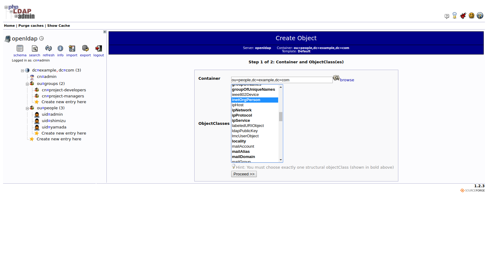

inetOrgPersonを選択して、Proceedをクリック。
以下の項目を設定する。

| 設定項目  | 設定値             | 備考 |
| --------- | ------------------ | ---- |
| RDN       | User Name(uid)     |      |
| cn        | Taro Tanaka        |      |
| sn        | Tanaka             |      |
| Email     | tanaka@example.com |      |
| givenName | Taro               |      |
| Password  | password / crypto  |      |
| Username  | tanaka             |      |

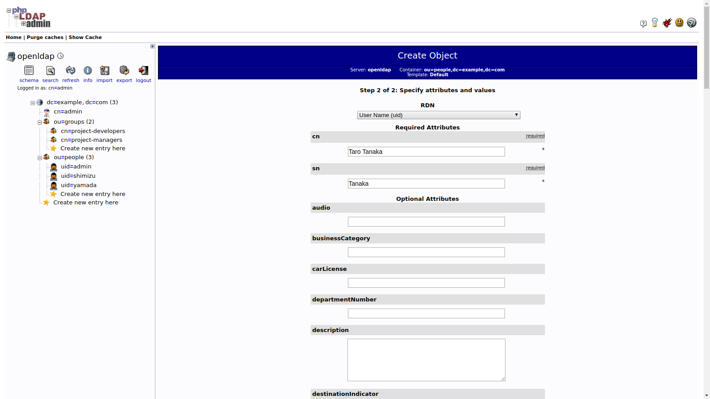

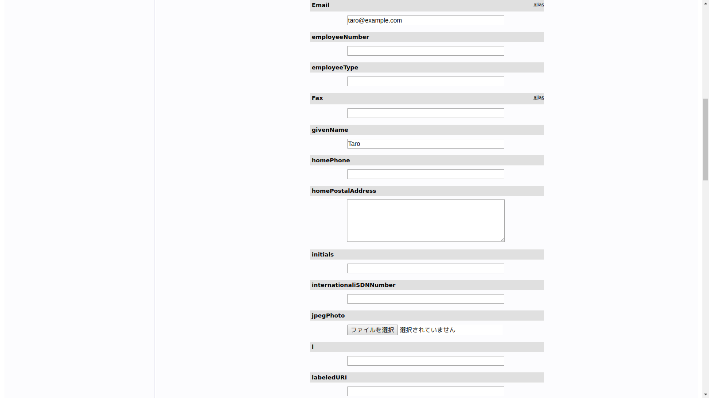

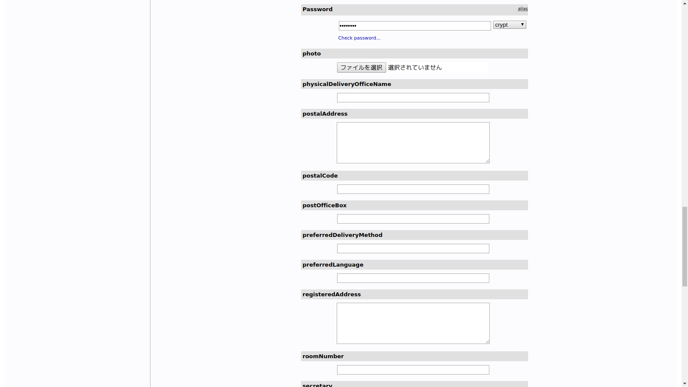

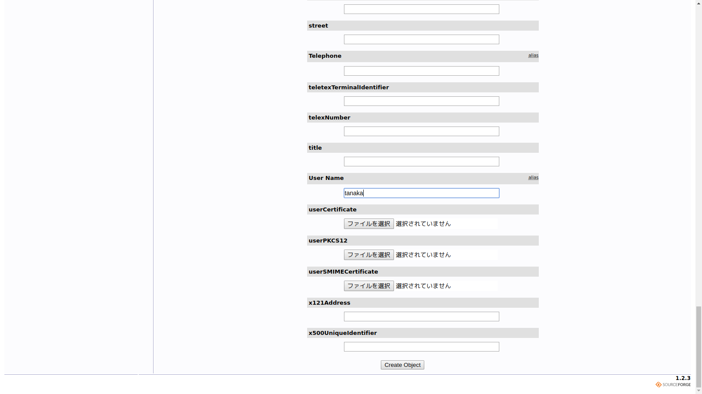

Create Objectをクリック。

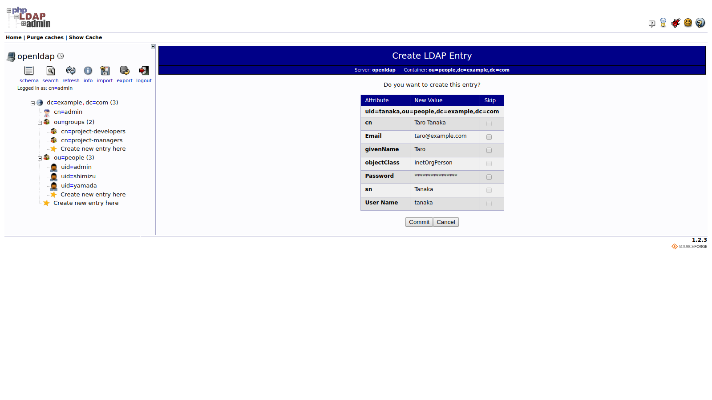

設定内容を確認して、Commitをクリック。
作成されたことを確認する。

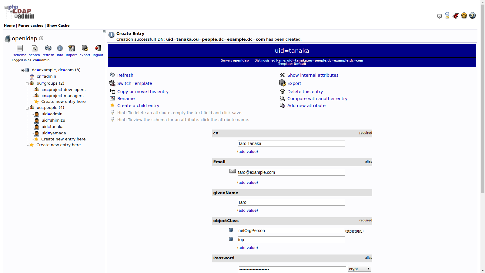

### グループへのユーザ追加

ou=groupsをクリック。

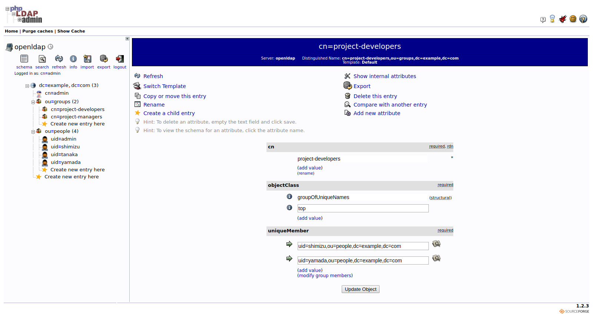

uniqueMemberのadd valueをクリック。

以下の項目を設定してUpdate Objectをクリック。

| 設定項目             | 設定値                                 | 備考 |
| -------------------- | -------------------------------------- | ---- |
| uniqueMember の3行目 | uid=tanaka,ou=people,dc=example,dc=com |      |

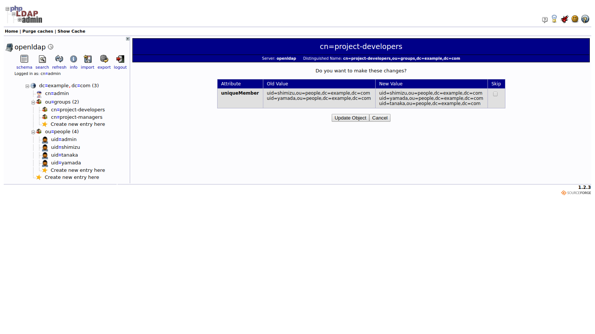

Update Objectをクリック。

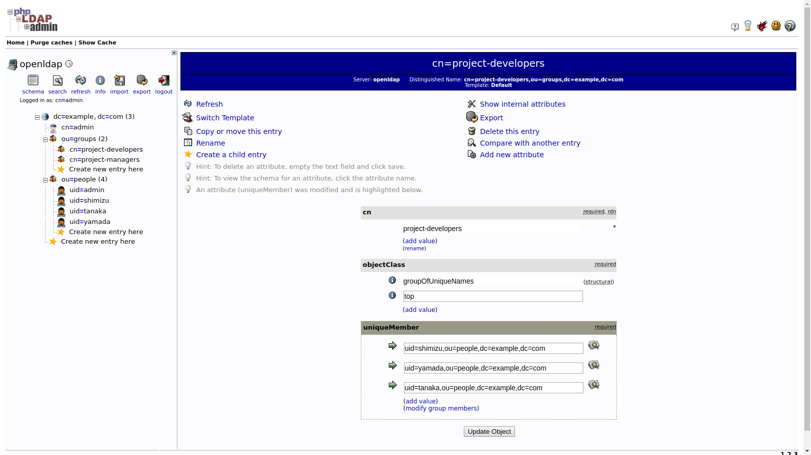

追加されたことを確認。

# エクスポート

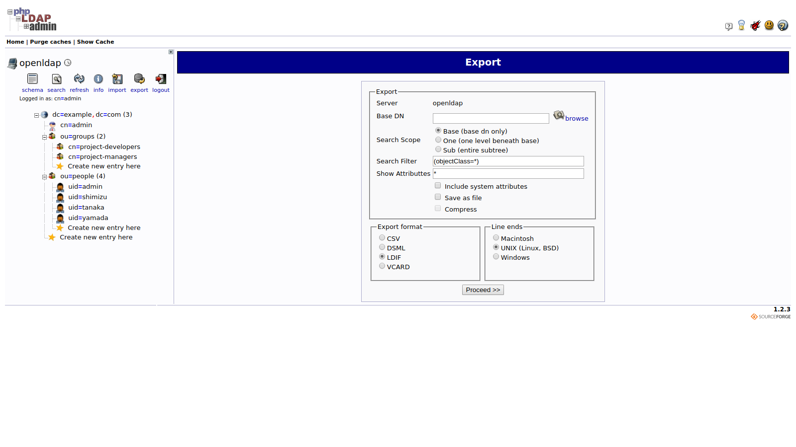

