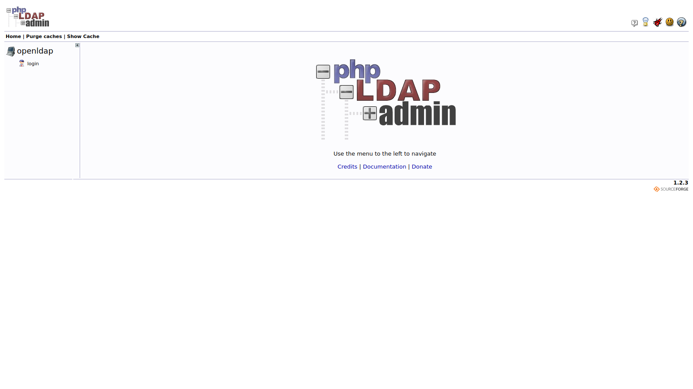
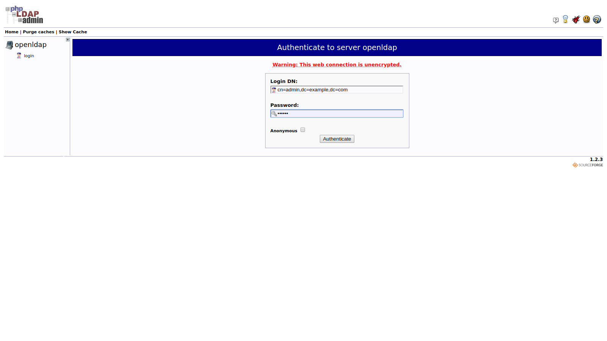
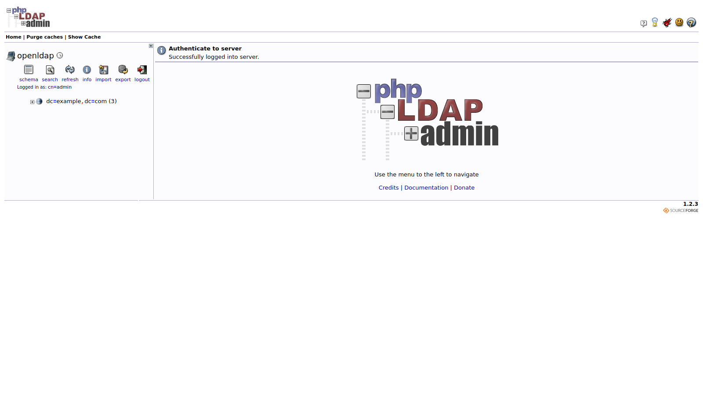
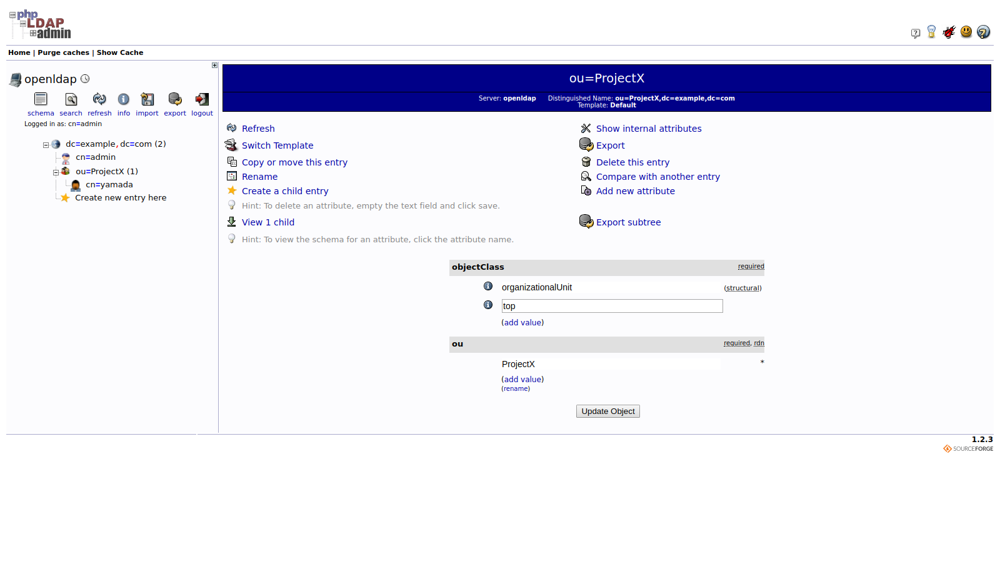
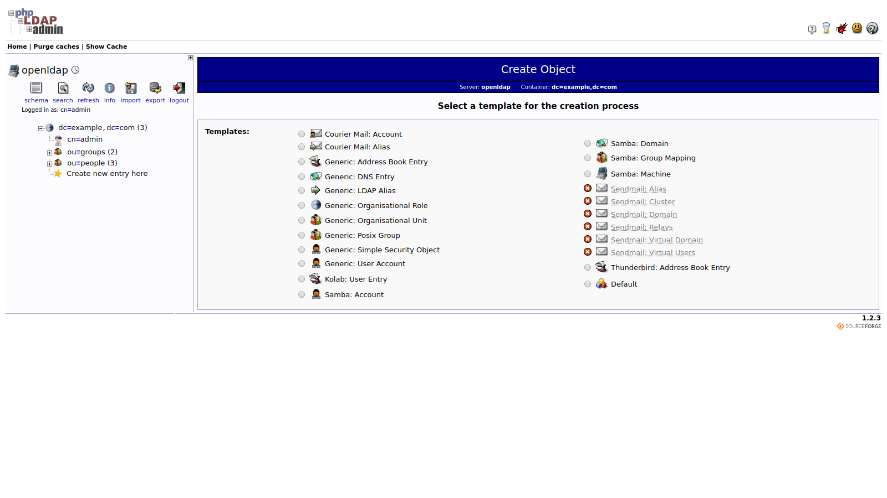
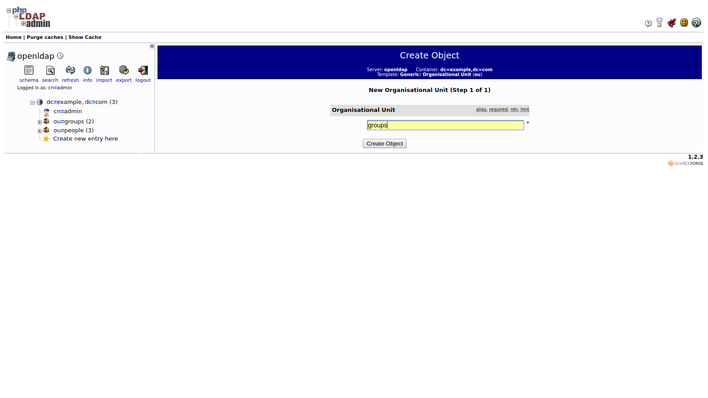
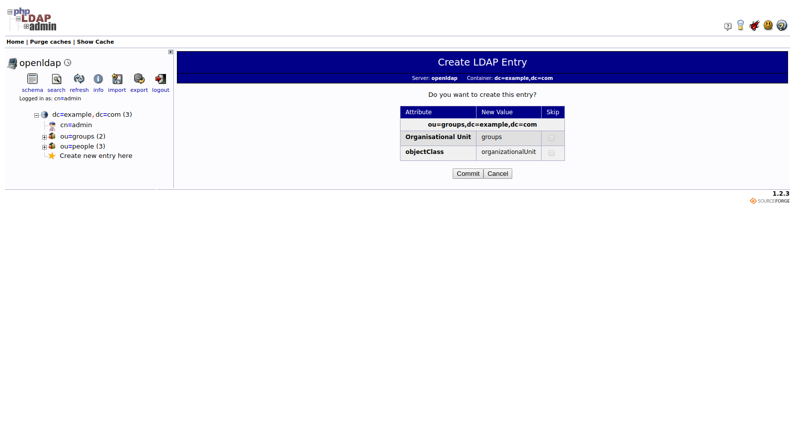
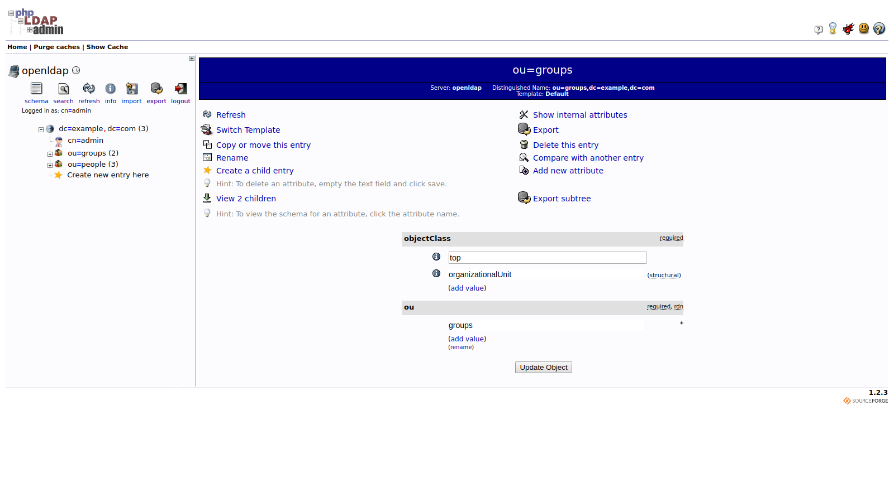
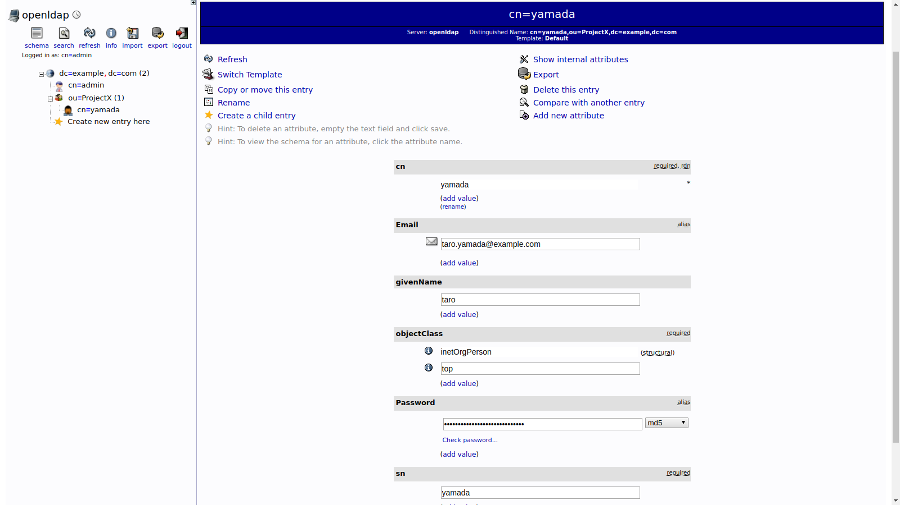

# ログイン

トップページでloginを押す。

| 設定項目 | 設定値                     | 備考 |
| -------- | -------------------------- | ---- |
| Login DN | cn=admin,dc=example,dc=com |      |
| Password | ldappw                     |      |

# Projectの作成

dc=example, dc=com (3)をクリック。

Create a child entryをクリック。

Generic: Organisational Unitをクリック。

| 設定項目            | 設定値 | 備考 |
| ------------------- | ------ | ---- |
| Organixational Unit | groups |      |

# ユーザの作成

