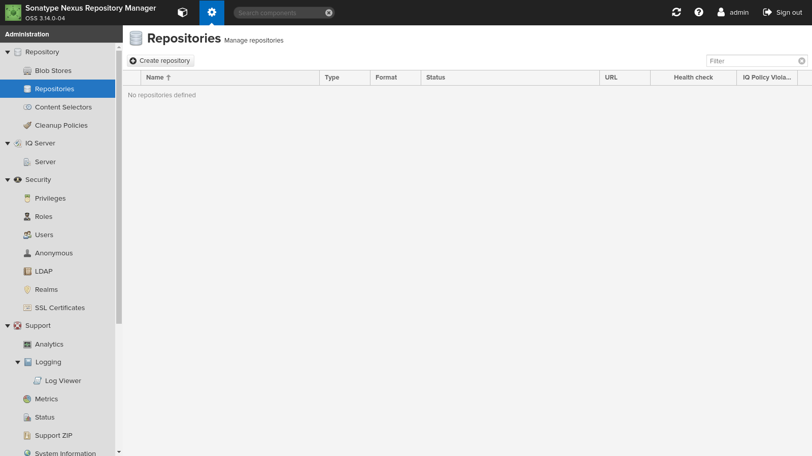
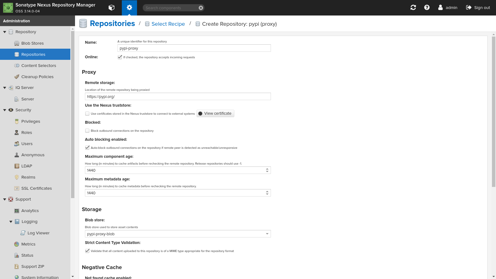

# Basic

## remove repository

## add backup task

| 設定項目           | 設定値        |
| ------------------ | ------------- |
| Task enabled       | チェック      |
| Task name          | task-backup   |
| Notification email |               |
| Backup location    | /nexus-backup |
| Task frequency     | Manual        |

# apt

## Blob Stores

### hosted

| 設定項目 | 設定値             |
| -------- | ------------------ |
| Type     | File               |
| Name     | apt-hosted-blob    |
| Path     | （自動生成される） |

### proxy

| 設定項目 | 設定値             |
| -------- | ------------------ |
| Type     | File               |
| Name     | apt-proxy-blob    |
| Path     | （自動生成される） |

## Repositories

### proxy

| 主要設定項目   | 設定値                           | 備考                         |
| -------------- | -------------------------------- | ---------------------------- |
| Name           | apt-proxy                        |                              |
| Distribution   | bionic                           | ターゲットOSに応じて変更する |
| Remote storage | http://archive.ubuntu.com/ubuntu | ターゲットOSに応じて変更する |
| Blob store     | apt-proxy-blob                   |                              |

## Tasks

### proxy

| 設定項目              | 設定値                 |
| --------------------- | ---------------------- |
| Task enabled          | チェック               |
| Task name             | apt-proxy-compact-task |
| Notification email    |                        |
| Blob store            | apt-proxy-blob         |
| Task frequency        | Daily                  |
| Start date            | 01/01/2019             |
| Time to run this task | 03:00                  |

# bower

## Blob Stores

### hosted

| 設定項目 | 設定値             |
| -------- | ------------------ |
| Type     | File               |
| Name     | bower-hosted-blob    |
| Path     | （自動生成される） |

### proxy

| 設定項目 | 設定値             |
| -------- | ------------------ |
| Type     | File               |
| Name     | bower-proxy-blob    |
| Path     | （自動生成される） |

## Repositories

### hosted

| 主要設定項目      | 設定値            | 備考                     |
| ----------------- | ----------------- | ------------------------ |
| Name              | bower-hosted      |                          |
| Blob store        | bower-hosted-blob |                          |
| Deployment policy | Allow redeploy    | 運用方針によって変更する |

### proxy

| 主要設定項目  | 設定値                    | 備考 |
| ------------- | ------------------------- | ---- |
| Name          | bower-proxy               |      |
| Remote strage | https://registry.bower.io |      |
| Blob store    | bower-proxy-blob          |      |

### group

| 主要設定項目 | 設定値                    | 備考 |
| ------------ | ------------------------- | ---- |
| Name         | bower-group               |      |
| Group        | bower-hosted, bower-proxy |      |

## Tasks

### hosted

| 設定項目              | 設定値                    |
| --------------------- | ------------------------- |
| Task enabled          | チェック                  |
| Task name             | bower-hosted-compact-task |
| Notification email    |                           |
| Blob store            | bower-hosted-blob         |
| Task frequency        | Daily                     |
| Start date            | 01/01/2019                |
| Time to run this task | 00:00                     |

### proxy

| 設定項目              | 設定値                   |
| --------------------- | ------------------------ |
| Task enabled          | チェック                 |
| Task name             | bower-proxy-compact-task |
| Notification email    |                          |
| Blob store            | bower-proxy-blob         |
| Task frequency        | Daily                    |
| Start date            | 01/01/2019               |
| Time to run this task | 00:00                    |

# docker

## Blob Stores

### hosted

| 設定項目 | 設定値             |
| -------- | ------------------ |
| Type     | File               |
| Name     | docker-hosted-blob    |
| Path     | （自動生成される） |

### proxy

| 設定項目 | 設定値             |
| -------- | ------------------ |
| Type     | File               |
| Name     | docker-proxy-blob    |
| Path     | （自動生成される） |

## Repositories

### hosted

| 主要設定項目      | 設定値             | 備考                     |
| ----------------- | ------------------ | ------------------------ |
| Name              | docker-hosted      |                          |
| HTTP              | 48083              |                          |
| Blob store        | docker-hosted-blob |                          |
| Deployment policy | Allow redeploy     | 運用方針によって変更する |

### proxy

| 主要設定項目         | 設定値                       | 備考 |
| -------------------- | ---------------------------- | ---- |
| Name                 | docker-proxy                 |      |
| HTTP                 | 48082                        |      |
| Enable Docker V1 API | チェック                     |      |
| Docker Index         | Use Docker Hub               |      |
| Remote strage        | https://registry-1.docker.io |      |
| Blob store           | docker-proxy-blob            |      |

### group

| 主要設定項目         | 設定値                      | 備考 |
| -------------------- | --------------------------- | ---- |
| Name                 | docker-group                |      |
| Enable Docker V1 API | チェック                    |      |
| Group                | docker-hosted, docker-proxy |      |

## Tasks

### hosted

| 設定項目              | 設定値                     |
| --------------------- | -------------------------- |
| Task enabled          | チェック                   |
| Task name             | docker-hosted-compact-task |
| Notification email    |                            |
| Blob store            | docker-hosted-blob         |
| Task frequency        | Daily                      |
| Start date            | 01/01/2019                 |
| Time to run this task | 00:30                      |

### proxy

| 設定項目              | 設定値                    |
| --------------------- | ------------------------- |
| Task enabled          | チェック                  |
| Task name             | docker-proxy-compact-task |
| Notification email    |                           |
| Blob store            | docker-proxy-blob         |
| Task frequency        | Daily                     |
| Start date            | 01/01/2019                |
| Time to run this task | 00:30                     |

# maven2

## Blob Stores

### hosted

| 設定項目 | 設定値             |
| -------- | ------------------ |
| Type     | File               |
| Name     | maven2-hosted-blob    |
| Path     | （自動生成される） |

### proxy

| 設定項目 | 設定値             |
| -------- | ------------------ |
| Type     | File               |
| Name     | maven2-proxy-blob    |
| Path     | （自動生成される） |

## Repositories

### hosted

| 主要設定項目      | 設定値             | 備考                     |
| ----------------- | ------------------ | ------------------------ |
| Name              | maven2-hosted      |                          |
| Version policy    | Release            |                          |
| Blob store        | maven2-hosted-blob |                          |
| Deployment policy | Allow redeploy     | 運用方針によって変更する |

### hosted-snapshot

| 主要設定項目      | 設定値                 | 備考                     |
| ----------------- | ---------------------- | ------------------------ |
| Name              | maven2-hosted-snapshot |                          |
| Version policy    | Snapshot               |                          |
| Blob store        | maven2-hosted-blob     |                          |
| Deployment policy | Allow redeploy         | 運用方針によって変更する |

### proxy

| 主要設定項目   | 設定値                          | 備考 |
| -------------- | ------------------------------- | ---- |
| Name           | maven2-proxy                    |      |
| Version policy | Release                         |      |
| Remote strage  | https://repo1.maven.org/maven2/ |      |
| Blob store     | maven2-proxy-blob               |      |

### group

| 主要設定項目 | 設定値                                              | 備考 |
| ------------ | --------------------------------------------------- | ---- |
| Name         | maven2-group                                        |      |
| Group        | maven2-hosted, maven2-proxy, maven2-hosted-snapshot |      |

## Tasks

### hosted

| 設定項目              | 設定値                     |
| --------------------- | -------------------------- |
| Task enabled          | チェック                   |
| Task name             | maven2-hosted-compact-task |
| Notification email    |                            |
| Blob store            | maven2-hosted-blob         |
| Task frequency        | Daily                      |
| Start date            | 01/01/2019                 |
| Time to run this task | 01:00                      |

### proxy

| 設定項目              | 設定値                    |
| --------------------- | ------------------------- |
| Task enabled          | チェック                  |
| Task name             | maven2-proxy-compact-task |
| Notification email    |                           |
| Blob store            | maven2-proxy-blob         |
| Task frequency        | Daily                     |
| Start date            | 01/01/2019                |
| Time to run this task | 01:00                     |

# npm

## Blob Stores

### hosted

| 設定項目 | 設定値             |
| -------- | ------------------ |
| Type     | File               |
| Name     | npm-hosted-blob    |
| Path     | （自動生成される） |

### proxy

| 設定項目 | 設定値             |
| -------- | ------------------ |
| Type     | File               |
| Name     | npm-proxy-blob    |
| Path     | （自動生成される） |

## Repositories

### hosted

| 主要設定項目      | 設定値          | 備考                     |
| ----------------- | --------------- | ------------------------ |
| Name              | npm-hosted      |                          |
| Blob store        | npm-hosted-blob |                          |
| Deployment policy | Allow redeploy  | 運用方針によって変更する |

### proxy

| 主要設定項目  | 設定値                     | 備考 |
| ------------- | -------------------------- | ---- |
| Name          | npm-proxy                  |      |
| Remote strage | https://registry.npmjs.org |      |
| Blob store    | npm-proxy-blob             |      |

### group

| 主要設定項目 | 設定値                | 備考 |
| ------------ | --------------------- | ---- |
| Name         | npm-group             |      |
| Group        | npm-hosted, npm-proxy |      |

## Tasks

### hosted

| 設定項目              | 設定値                  |
| --------------------- | ----------------------- |
| Task enabled          | チェック                |
| Task name             | npm-hosted-compact-task |
| Notification email    |                         |
| Blob store            | npm-hosted-blob         |
| Task frequency        | Daily                   |
| Start date            | 01/01/2019              |
| Time to run this task | 01:30                   |

### proxy

| 設定項目              | 設定値                 |
| --------------------- | ---------------------- |
| Task enabled          | チェック               |
| Task name             | npm-proxy-compact-task |
| Notification email    |                        |
| Blob store            | npm-proxy-blob         |
| Task frequency        | Daily                  |
| Start date            | 01/01/2019             |
| Time to run this task | 01:30                  |

# pypi

## Blob Stores

### hosted

| 設定項目 | 設定値             |
| -------- | ------------------ |
| Type     | File               |
| Name     | pypi-hosted-blob    |
| Path     | （自動生成される） |

### proxy

| 設定項目 | 設定値             |
| -------- | ------------------ |
| Type     | File               |
| Name     | pypi-proxy-blob    |
| Path     | （自動生成される） |

## Repositories

### hosted

| 主要設定項目      | 設定値           | 備考                     |
| ----------------- | ---------------- | ------------------------ |
| Name              | pypi-hosted      |                          |
| Blob store        | pypi-hosted-blob |                          |
| Deployment policy | Allow redeploy   | 運用方針によって変更する |

### proxy

| 主要設定項目  | 設定値            | 備考 |
| ------------- | ----------------- | ---- |
| Name          | pypi-proxy        |      |
| Remote strage | https://pypi.org/ |      |
| Blob store    | pypi-proxy-blob   |      |

### group

| 主要設定項目 | 設定値                  | 備考 |
| ------------ | ----------------------- | ---- |
| Name         | pypi-group              |      |
| Group        | pypi-hosted, pypi-proxy |      |

## Tasks

### hosted

| 設定項目              | 設定値                   |
| --------------------- | ------------------------ |
| Task enabled          | チェック                 |
| Task name             | pypi-hosted-compact-task |
| Notification email    |                          |
| Blob store            | pypi-hosted-blob         |
| Task frequency        | Daily                    |
| Start date            | 01/01/2019               |
| Time to run this task | 02:00                    |

### proxy

| 設定項目              | 設定値                  |
| --------------------- | ----------------------- |
| Task enabled          | チェック                |
| Task name             | pypi-proxy-compact-task |
| Notification email    |                         |
| Blob store            | pypi-proxy-blob         |
| Task frequency        | Daily                   |
| Start date            | 01/01/2019              |
| Time to run this task | 02:00                   |

# yum

## Blob Stores

### hosted

| 設定項目 | 設定値             |
| -------- | ------------------ |
| Type     | File               |
| Name     | yum-hosted-blob    |
| Path     | （自動生成される） |

### proxy

| 設定項目 | 設定値             |
| -------- | ------------------ |
| Type     | File               |
| Name     | yum-proxy-blob    |
| Path     | （自動生成される） |

## Repositories

### hosted

| 主要設定項目      | 設定値          | 備考                     |
| ----------------- | --------------- | ------------------------ |
| Name              | yum-hosted      |                          |
| Blob store        | yum-hosted-blob |                          |
| Deployment policy | Allow redeploy  | 運用方針によって変更する |

### proxy

| 主要設定項目  | 設定値                           | 備考                         |
| ------------- | -------------------------------- | ---------------------------- |
| Name          | yum-proxy                        |                              |
| Remote strage | http://mirror.centos.org/centos/ | ターゲットOSに応じて変更する |
| Blob store    | yum-proxy-blob                   |                              |

### group

| 主要設定項目 | 設定値                | 備考 |
| ------------ | --------------------- | ---- |
| Name         | yum-group             |      |
| Group        | yum-hosted, yum-proxy |      |

## Tasks

### hosted

| 設定項目              | 設定値                  |
| --------------------- | ----------------------- |
| Task enabled          | チェック                |
| Task name             | yum-hosted-compact-task |
| Notification email    |                         |
| Blob store            | yum-hosted-blob         |
| Task frequency        | Daily                   |
| Start date            | 01/01/2019              |
| Time to run this task | 00:00                   |

### proxy

| 設定項目              | 設定値                 |
| --------------------- | ---------------------- |
| Task enabled          | チェック               |
| Task name             | yum-proxy-compact-task |
| Notification email    |                        |
| Blob store            | yum-proxy-blob         |
| Task frequency        | Daily                  |
| Start date            | 01/01/2019             |
| Time to run this task | 02:30                  |

