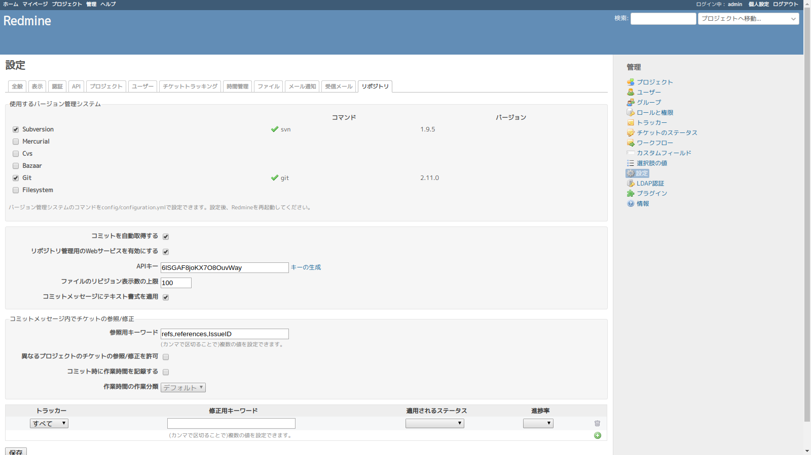
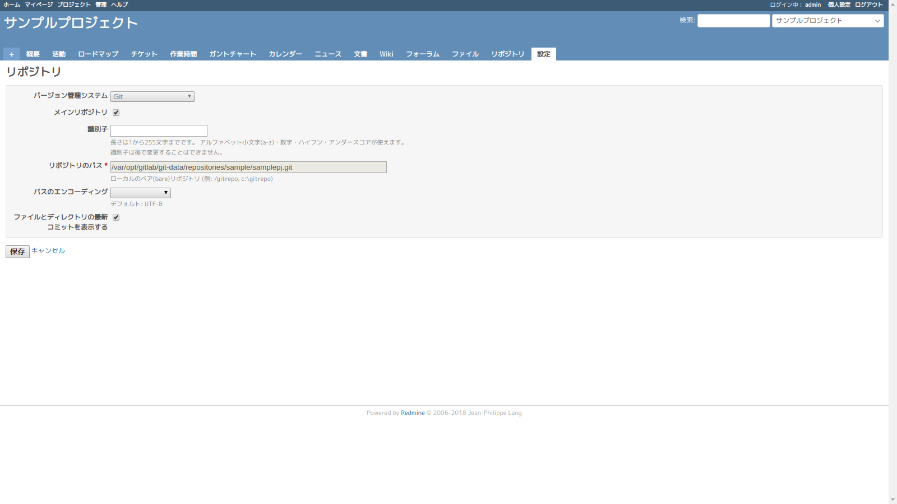

# 初回ログイン

## パスワード変更

| 設定項目         | 設定値   |
| ---------------- | -------- |
| パスワード       | admin    |
| 新しいパスワード | admin123 |

## 個人設定

# 設定

## デフォルト設定のロード

### 変更前

### 変更後

## 管理

### 変更前

### 変更後

| 設定項目         | 設定値   |
| ---------------- | -------- |
| テキスト書式 | Markdown |

## 表示

### 変更前

### 変更後

| 設定項目         | 設定値   |
| ---------------- | -------- |
| デフォルトの言語       | Janapese    |
| 匿名ユーザーにデフォルトの言語を強制 | チェック |
| ユーザー名の表示形式 | admin |

## API

### 変更前

### 変更後

| 設定項目         | 設定値   |
| ---------------- | -------- |
| RESTによるWebサービスを有効にする       | Janapese    |
| JSONPを有効にする | チェック |

## チケットトラッキング

### 変更前

### 変更後

| 設定項目         | 設定値   |
| ---------------- | -------- |
| 異なるプロジェクトのチケット間で関連の設定を許可       | チェック    |
| チケットをコピーしあと気に関連を設定 | いいえ |
| 異なるプロジェクトのチケット間の親子関係を許可 | すべてのプロジェクト |

## リポジトリ

### 変更前

### 変更後

| 設定項目         | 設定値   |
| ---------------- | -------- |
| 使用するバージョン管理システム       | Subversion, Git    |
| リポジトリ管理用のWebサービスを有効にする | チェック |

# LDAP認証

## 設定

| 設定項目               | 設定値                      |
| ---------------------- | --------------------------- |
| 名称                   | openLDAP                    |
| ホスト                 | openldap                    |
| ポート                 | 389                         |
| アカウント             | cn=admin,dc=example,dc=com  |
| パスワード             | ldappw                      |
| ベースDN               | ou=people,dc=example,dc=com |
| LDAPフィルタ           |                             |
| タイムアウト（秒単位） |                             |
| あわせてユーザーを作成 | チェック                    |
| ログインIDの属性       | uid                         |
| 名の属性               | givenName                   |
| 姓の属性               | sn                          |
| メールアドレスの属性   | mail                        |

## ログイン確認

# サンプルプロジェクト作成

## 新しいプロジェクト

| 設定項目 | 設定値               |
| -------- | -------------------- |
| 名称     | サンプルプロジェクト |
| 識別子   | sample               |

## カテゴリ作成

| 設定項目 | 設定値               |
| -------- | -------------------- |
| 名称     | エイプリルフールネタ |

## バージョン作成

| 設定項目 | 設定値 |
| -------- | ------ |
| 名称     | v1     |

| 設定項目 | 設定値 |
| -------- | ------ |
| 名称     | v2     |

## フォーラム作成

| 設定項目 | 設定値             |
| -------- | ------------------ |
| 名称     | サンプルフォーラム |
| 説明     | さんぷるです。     |

## メンバー設定

## リポジトリ設定

| 設定項目         | 設定値   |
| ---------------- | -------- |
| バージョン管理システム       | Git    |
| メインリポジトリ | Enable |
| リポジトリのパス | /var/opt/gitlab/git-data/repositories/sample/samplepj.git |
| ファイルとディレクトリの最新コミットを表示する | Enable |

## チケット作成

| 設定項目       | 設定値               |
| -------------- | -------------------- |
| トラッカー     | バグ                 |
| 題名           | サンプルチケット     |
| 担当者         | Redmine Admin        |
| カテゴリ       | エイプリルフールネタ |
| 対象バージョン | v1                   |
| 期日           | 2019/01/31           |

