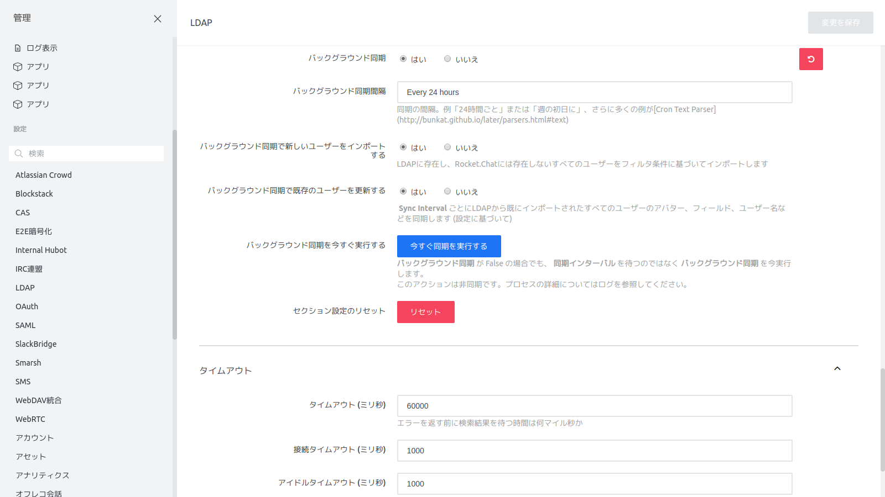

# セットアップウィザード

## 管理者情報

| 設定項目         | 設定値         |
| ---------------- | -------------- |
| 名前             | admin          |
| ユーザ名         | admin          |
| 組織の電子メール | admin@test.com |
| パスワード       | admin123       |

## 組織情報

| 設定項目     | 設定値           |
| ------------ | ---------------- |
| 組織の種類   | オプションを選択 |
| 組織名       |                  |
| 産業         | オプションを選択 |
| サイズ       | オプションを選択 |
| カントリー   | オプションを選択 |
| ウェブサイト |                  |

## サーバ情報

| 設定項目       | 設定値           |
| -------------- | ---------------- |
| サイト名       |                  |
| 言語           | デフォルト       |
| サーバーの種類 | オプションを選択 |

## 登録サーバ情報

| 設定項目     | 設定値                                             |
| ------------ | -------------------------------------------------- |
| 登録サーバー | スタンドアローンを保つ、あなたはする必要があります |

# 管理

## LDAP設定

| 設定項目                       | 設定値            |
| ------------------------------ | ----------------- |
| 有効にする                     | はい              |
| ログインフォールバック         | はい              |
| ログイン後にユーザーを検索する | はい              |
| ホスト                         | openldap          |
| ポート                         | 389               |
| 再接続します                   | はい              |
| 暗号化                         | 暗号化しない      |
| ベースDN                       | dc=example,dc=com |
| 内部ログレベル                 | 無効              |

### 認証

| 設定項目                         | 設定値                                                       |
| -------------------------------- | ------------------------------------------------------------ |
| 有効                             | はい                                                         |
| ユーザDN                         | cn=admin,dc=example,dc=com                                   |
| パスワード                       | ladppw                                                       |

### 同期とインポート

| 設定項目                                             | 設定値                        |
| ---------------------------------------------------- | ----------------------------- |
| ユーザ名フィールド                                   | uid                           |
| 一意性を識別するフィールド                           | uid                           |
| 既定ドメイン                                         | rocket.chat                   |
| 既存のユーザーをマージする                           | いいえ                        |
| データを同期する                                     | はい                          |
| ユーザーデータのフィールドマップ                     | {"cn":"name", "mail":"email"} |
| ユーザーのアバターを同期する                         | いいえ                        |
| バックグラウンド同期                                 | はい                          |
| バックグラウンド同期間隔                             | Every 24 hours                |
| バックグラウンド同期で新しいユーザーをインポートする | はい                          |
| バックグラウンド同期で既存のユーザーを更新する       | はい                          |
| 検索フィールド                                       | uid                           |

### ユーザ検索

### ユーザー

### LDAPログイン

| 設定項目   | 設定値   | 備考 |
| ---------- | -------- | ---- |
| ユーザー名 | yamada   |      |
| パスワード | password |      |

## ユーザー設定

### bot追加

| 設定項目                     | 設定値          |
| ---------------------------- | --------------- |
| 名前                         | bot             |
| ユーザー名                   | bot             |
| メール                       | bot@example.com |
| 検証                         |                 |
| パスワード                   | bot             |
| パスワードの変更を要求       |                 |
| Roles                        | bot             |
| デフォルトのチャンネルに参加 | チェック        |
| ようこそメールを送信         |                 |

## ログ設定

### 変更前

### 変更後

| 設定項目   | 設定値           |
| ---------- | ---------------- |
| ログレベル | 1 - エラーと情報 |

## 全般設定

### サイトURL設定

#### 変更前

#### 変更後

| 設定項目  | 設定値                           |
| --------- | -------------------------------- |
| サイトURL | http://localhost:3000/rocketchat |

