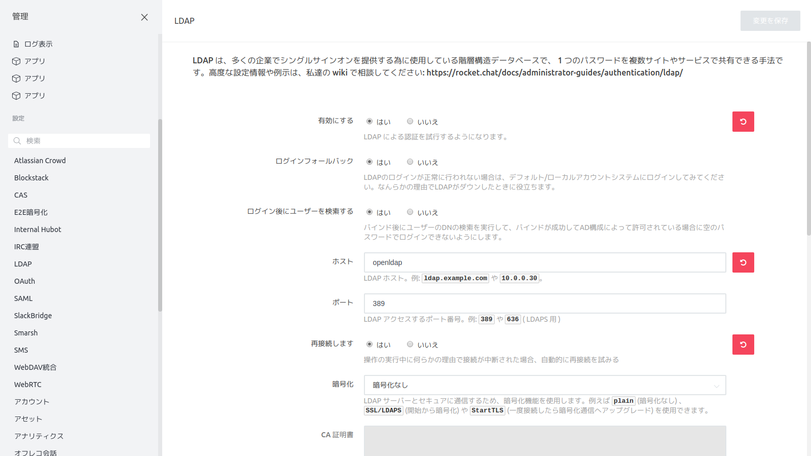

# セットアップウィザード

## 管理者情報

- 名前
  admin
- ユーザ名
  admin
- 組織の電子メール
  admin@test.com
- パスワード
  admin123

## 組織情報

- 組織の種類
  オプションを選択
  
- 組織名
  空欄
  
- 産業
  オプションを選択
  
- サイズ
  オプションを選択
  
- カントリー
  オプションを選択
  
- ウェブサイト
  空欄

## サーバ情報

- サイト名
  空欄

- 言語

  デフォルト

- サーバーの種類

  オプションを選択

## 登録サーバ情報

- 「スタンドアローンを保つ、あなたはする必要があります」

  チェック

# 管理

## LDAP設定

## ユーザー設定

### bot追加

## ログ設定

### 変更前

### 変更後

## 全般設定

### サイトURL設定

#### 変更前

#### 変更後

